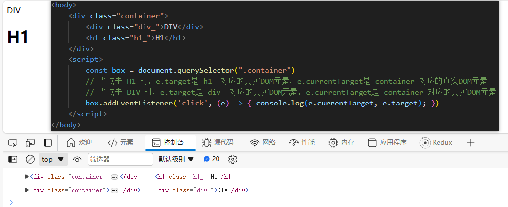

在初渲染，构建fiber节点是深度优先，一直探索到叶子结点，直到其没有孩子了就是开始 **completeUnitOfWork** 这个操作会 创建正式DOM 

```js
workInProgress.stateNode = createTextInstance(newText);
```

之后合并其所有后代的副作用标识：

```js
function bubbleProperties(completedWork) {
  let subtreeFlags = NoFlags;
  let child = completedWork.child;
  while (child !== null) {
    subtreeFlags |= child.subtreeFlags;
    subtreeFlags |= child.flags;
    child = child.sibling;
  }
  completedWork.subtreeFlags |= subtreeFlags;
}
```

然后继续探索该完成节点的兄弟节点，知道其没有兄弟节点，这代表其父节点所有海子节点已完成创建工作，这是完成父亲，接着下一个准备父亲的兄弟，知道工作单元为空，此时已经来到了容器节点，

进入while循环中的一定是无孩子的fiber,或者是孩子已经全部完成而返回的父fiber,那么当返回到这个父fiber的时候，这个父fiber也一定也完成了，之后就是找这个父fiber的兄弟

在初渲染时，创建


先构建fiber树，completeUnitOfWork(unitOfWork)会创建unitOfWork.stateNode

```js
// finishedWork就是新构建的fiber,双渲染技术中最新的那个
const finishedWork = root.current.alternate;
```

h1的fiber的flag是2,因为其父fiber.current存在，所以创建h1 fiber的时候走的是
```js
workInProgress.child = reconcileChildFibers(workInProgress, current.child, nextChildren);
// 而 
const reconcileChildFibers = createChildReconciler(true);
```
但是其子节点因为h1的fiber.current不存在，所以flag都是0

注册两阶段的回调

+ 冒泡 = 0 
+ 捕获 = 4

```html
<h1>
    hello
    <span style={{ color: "red" }}>
        world
    </span>
</h1>
```
当我点击world时，currentTarget和target分别是什么
在给定的HTML结构中，当你点击"world"时，事件将首先在span元素上触发，然后冒泡到父元素h1上。
因此，事件的currentTarget和target属性的值将取决于点击的具体位置。

+ 当你点击"world"时：
+ currentTarget将是h1元素，因为点击事件当前正在处理h1元素（它是绑定了事件处理程序的元素）。
+ target将是span元素，因为span元素是事件最初的目标，它触发了点击事件。
换句话说，currentTarget始终是绑定了事件处理程序的元素（即事件处理函数所在的元素），而target是实际触发事件的那个元素。

